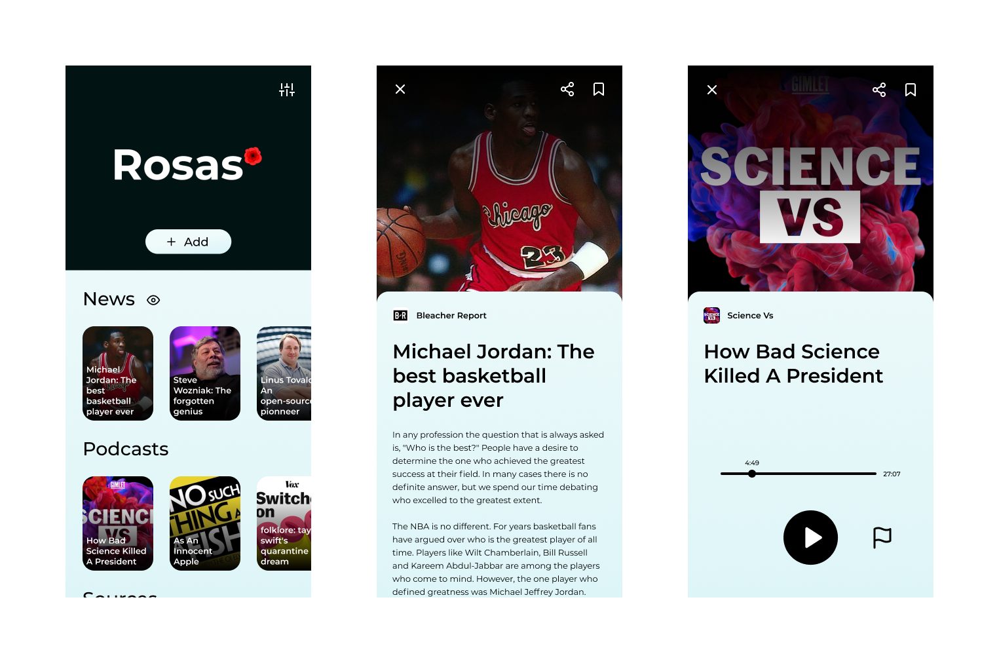

<!-- # Rosas

A beautiful RSS reader. -->

<p align="center">

</p>

## Features

- Papers (with Feedly)
- Podcasts (with iTunes)

## Getting Started

To build the `.apk` file for this project, use:

```bash
flutter build apk
```

## Mockup

[Figma file](https://www.figma.com/file/Q1KDyNPZQ7TtgVnvGuHVPU/Rosas?node-id=424%3A2)

<p align="center">

</p>